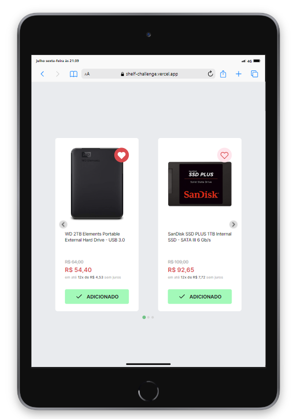

# SHELF CHALLENGE - B8ONE

Shelf desenvolvida de acordo com os requisitos técnicos

## Link projeto

- https://shelf-challenge.vercel.app/

## Tecnologias

- Vite
- ReactJS
- Typescript
- Sass
- API: https://fakestoreapi.com/
- React Splide: https://splidejs.com/integration/react-splide/
- LocalStorage
- Vercel

## Features adicionais

- React splide
- Armazenamento no localstorage de lista de favoritos e produtos

## Instalação

Instale shelf-challenge com npm ou yarn

```bash
  cd shelf-challenge
  npm install
```

## Funcionalidades

- Wish List
- Minicart
- Slider

## Screenshots

Desktop:


Tablet:



Mobile:


## Demonstração

Slider Carrossel:


LocalStorage:


